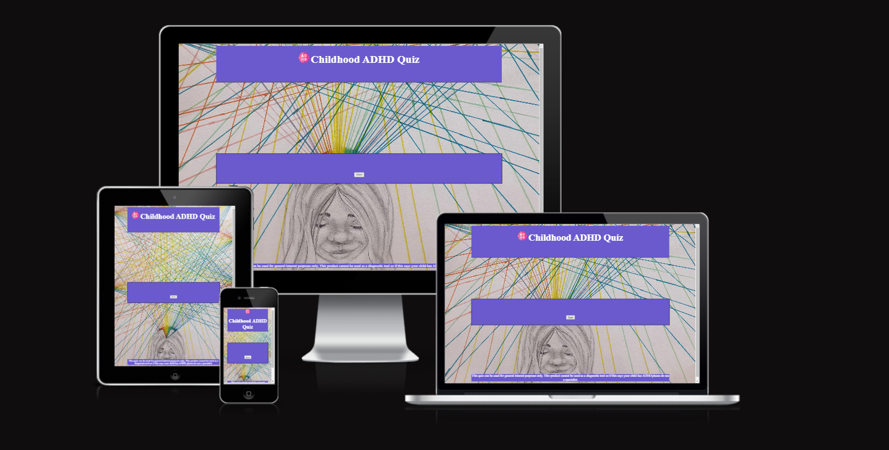

# Childhood ADHD Quiz

This project was made using Javascript, HTML and CSS to check the likelihood of your child/children having ADHD and which of the 5 different categories of symptoms they fall into. The target audience of this website is parents who are concerned that their child may have ADHD, teachers/school staff aiming to get an idea of the childs needs or even psychologists as we use the Conners test to build this and that would be the main test for childhood ADHD as it stands it alone cannot be used to make diagnosis as people can lie on the test but in the hands of a specialist can be used to help them reach a decision.

This website is mainly aimed at parents and if answered honestly can be used for pre screening for their children and to hopefully cut down the long waiting lists, 9 years plus in some countries to get a diagnosis.

This website can also be used in educational purposes as it breaks ADHD into the different categories of symptoms and gives a good overview on the people who display symptoms from these categories.

This can also be used by teenagers to do a self screening as the Conners test is applicable between ages of 6 to 18 and although this can't give a diagnosis knowing the likelihood can help some teenagers feel better about why things seem more difficult for them.

The aim is to work from this product to one day build a diagnostic app to cut out the long waiting times for diagnosis so that no child should be left behind.

I would ideally like to introduce ths to parents using SEO marketing, leveraging schools as they would like to assist parents in this and word of mouth ideally.

## User Stories

- As a student, I can check the likelihood of ADHD in myself, so that I can use resources gained to help myself study and learn in a way that works for me.
- As a parent, I can prescreen my own kids for ADHD and use the ADHD Assessment locator to best get my children diagnosed and find them the help they need.
- As a teacher, I can screen kids based off the multiple different categories so I know how best to plan my lessons so no child gets left behind.
