# Childhood ADHD Quiz

This project was made using Javascript, HTML and CSS to check the likelihood of your child/children having ADHD and which of the 5 different categories of symptoms they fall into. The target audience of this website is parents who are concerned that their child may have ADHD, teachers/school staff aiming to get an idea of the childs needs or even psychologists as we use the Conners test to build this and that would be the main test for childhood ADHD as it stands it alone cannot be used to make diagnosis as people can lie on the test but in the hands of a specialist can be used to help them reach a decision.

This website is mainly aimed at parents and if answered honestly can be used for pre screening for their children and to hopefully cut down the long waiting lists, 9 years plus in some countries to get a diagnosis.

This website can also be used in educational purposes as it breaks ADHD into the different categories of symptoms and gives a good overview on the people who display symptoms from these categories.

This can also be used by teenagers to do a self screening as the Conners test is applicable between ages of 6 to 18 and although this can't give a diagnosis knowing the likelihood can help some teenagers feel better about why things seem more difficult for them.

The aim is to work from this product to one day build a diagnostic app to cut out the long waiting times for diagnosis so that no child should be left behind.

I would ideally like to introduce ths to parents using SEO marketing, leveraging schools as they would like to assist parents in this and word of mouth ideally.

## User Stories

- As a student, I can check the likelihood of ADHD in myself, so that I can use resources gained to help myself study and learn in a way that works for me.
- As a parent, I can prescreen my own kids for ADHD and use the ADHD Assessment locator to best get my children diagnosed and find them the help they need.
- As a teacher, I can screen kids based off the multiple different categories so I know how best to plan my lessons so no child gets left behind.

## Wireframe

Wireframe was created with Balsamiq and some changes have been made since this stage

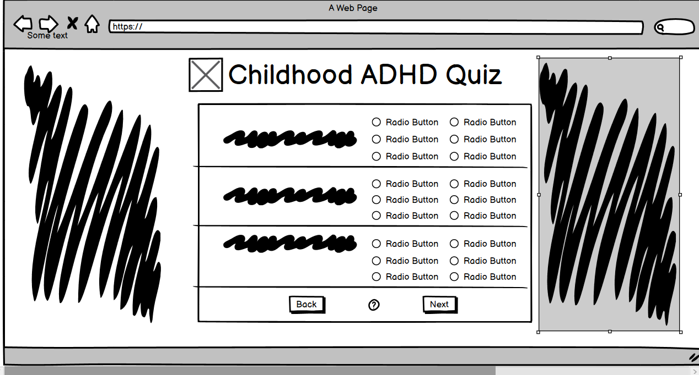
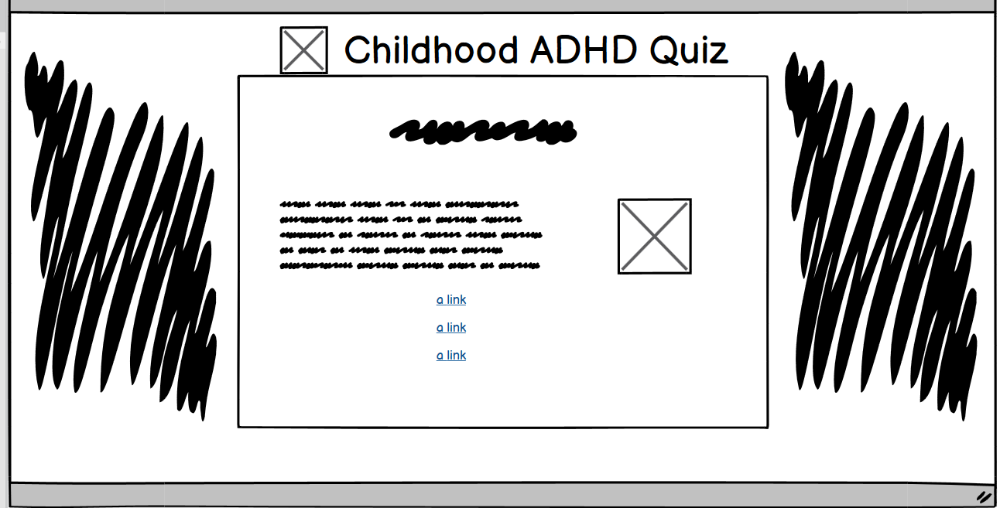

There is two wireframes seen here. The first one is for the quiz page, made some changes since this design and changed to one question per page and chose drop down boxes instead of radio buttons. The second is the results page, the original wireframe was when it was initially only giving information on ADHD and not the symptoms categories, added in the 5 categories and the search bar, kept the rest the same but just added to this.

## Features 

- __Header__

- this is featured on the top of the page and contains the name of the website and a logo which was downloaded from favicon.
- This is responsive and can be scaled for different browsers and screen sizes and will remain on top.
- The background and font colour follows same page layout.
  
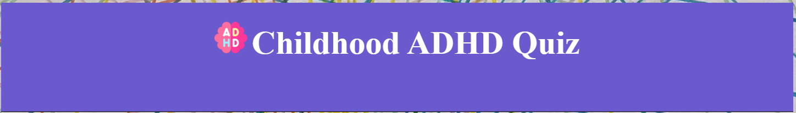

- __Footer__

- this is featured on the bottom of the page.
- This is responsive and can be scaled for different browsers and screen sizes.
- It has a disclaimer that this cannot actually be used to diagnose and is for screening purposes only.
  
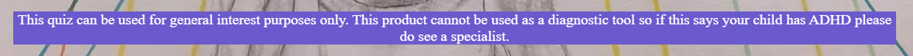

- __Quiz Area__

- This is the center focus of the page and contains navigation buttons and will populate all 24 questions and drop downs.
- This is designed to be resposive and also with larger text both for design and to help people with sight difficulties.
- It is also designed to be simple and easy to use.

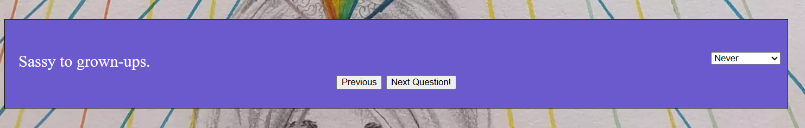

- __Navigational Buttons__

- A next and a previous buttons to easily move through all 24 questions.
- Previous button will not allow movement before first question and next wont allow past last.
- Designed to be easy to understand.

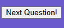

- __Submit and Show Result__

- Submit button appears when all questions answered and show result appears after submit clicked.
- Submit button calculates scores up between all 6 metrics. Show Result reveals info based off each metric reached.
- Designed to be easy to understand.

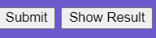

- __Main result__

- This displays if your score is above the limit to be considered of ADHD.
- This gives an overview of ADHD and links to assessments and more resources.

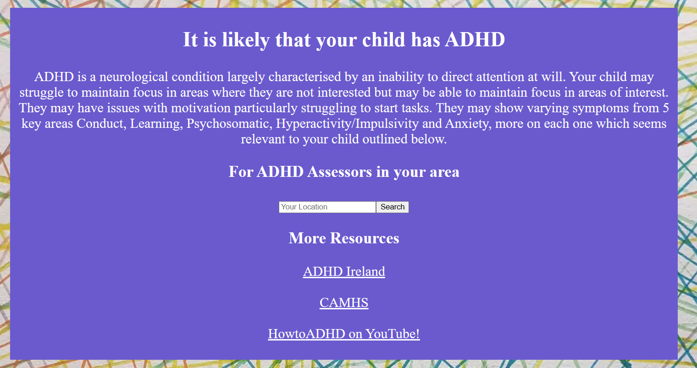

- __Search Bar__

- This displays if your score is above the limit to be considered of ADHD.
- This has an input box where you can type in your current application.
- When you click search it will bring you to links for adhd assessors near the location in the input box.
- Link open in a seperate tab to not take away from current website.

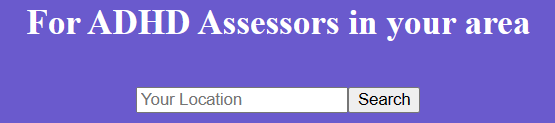

- __More Resources__

- This displays if your score is above the limit to be considered of ADHD.
- This has links to more resources that could be handy to know if your child may have ADHD.
- There is a link to ADHD Ireland, CAMHS and some YouTube videos that have helpful advice and information.
- All links open in seperate tabs to not take away from current website.

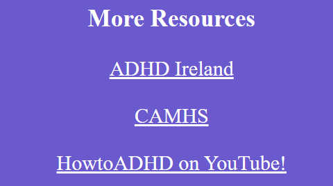

- __Conduct__

- This displays if your responses display conduct/behavioural problems. 
- This has an insight into children who have these issues
- The colour from this and 4 other symptom categories are the colours of the ADHD flag.

- __Learning__

- This displays if your responses display learning problems. 
- This has an insight into children who have these issues
- The colour from this and 4 other symptom categories are the colours of the ADHD flag.

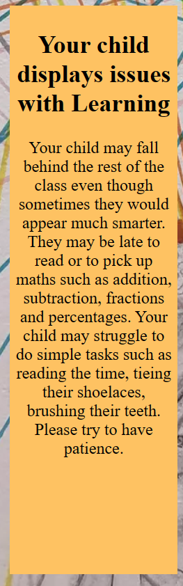

- __Psychosomatic__

- This displays if your responses display psychosomatic problems. 
- This has an insight into children who have these issues
- The colour from this and 4 other symptom categories are the colours of the ADHD flag.

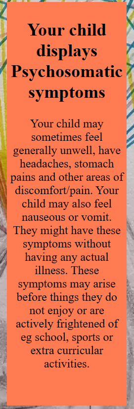

- __Hyperactive and Impulsive__

- This displays if your responses display hyperactive/impulsive problems. 
- This has an insight into children who have these issues
- The colour from this and 4 other symptom categories are the colours of the ADHD flag.

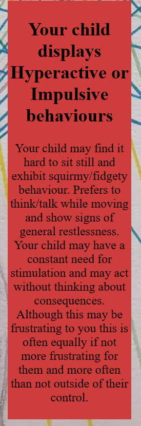

- __Anxiety__

- This displays if your responses display anxiety problems. 
- This has an insight into children who have these issues
-  The colour from this and 4 other symptom categories are the colours of the ADHD flag.

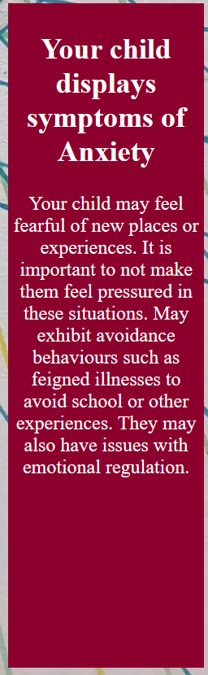

## Testing

I have tested this webpage using W3C validator for HTML and Jigsaw validator for CSS and JSHint for JavaScript.

All interactions on the web page have also been tested on multiple devices and all work as expected.

All links take you to where they are meant to bring you and open in different tabs.

Search bar link takes you to google search of closest ADHD assessors to location put into input box and I checked this with a large number of different towns globally.

Tested the quiz multiple times with and without the table visible to ensure that it displayed the correct information based off all 6 scoring metrics and that all questions filtered to the right area and all 4 buttons work as expected.

I tested this for accessibility across multiple different browsers and used Google Dev tools to check accross devices. I used google dev tools and resized by hand to every possible dimension to ensure website still looked good and also used a screenshot from Am I Responsive to ensure page scaled well across all device sizes, please see screenshot on top of file.
I checked this on screens ranging from 320 to 1980 pixels.

I also used Wave to check for contrast and errors and found one error, no label for input box, after multiple different tests I found that having placeholder text instead of a label looked better and better complemented the design of the website, also received a contrast ratio of 8.59:1 on index.html.

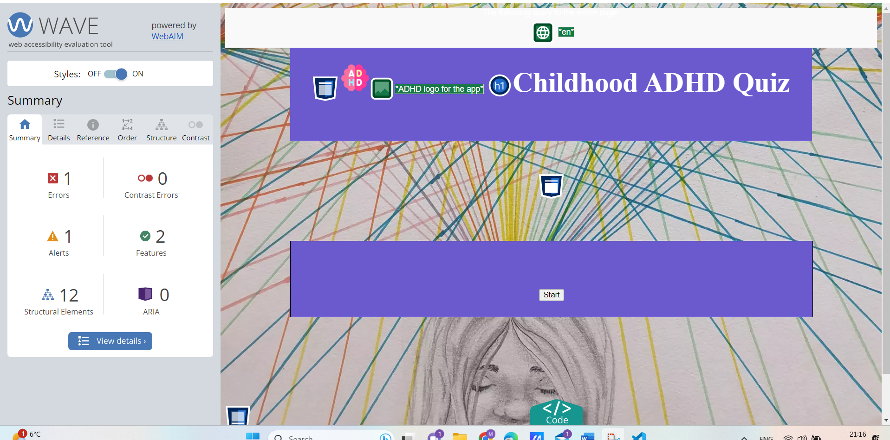
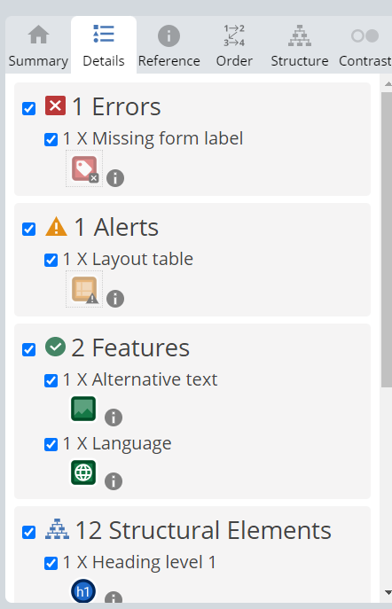

I also used lighthouse to test and got a high score across all metrics.

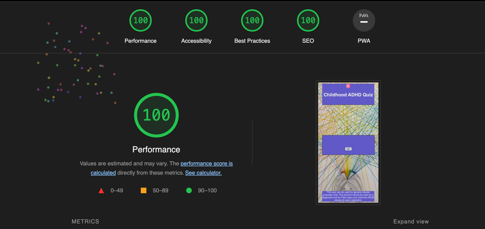

### Bugs

I encountered one bug where my next button was skipping the first question and needed double click on change from next to previous or previous to next and then answers added scores to incorrect questions, had to change i to -1 for beginning and add a -1 to after questions.length in the display function.
Also found another bug where I could not make the scores carry until the very end, to fix this I had to nest a function within display questions function before the calculateScores function was called and add a hidden HTML table to the HTML page which would filter scores in after submit was clicked.

### Validator Testing

 - HTML
  - No errors returned on any page when running through the official [W3C Validator] 
    
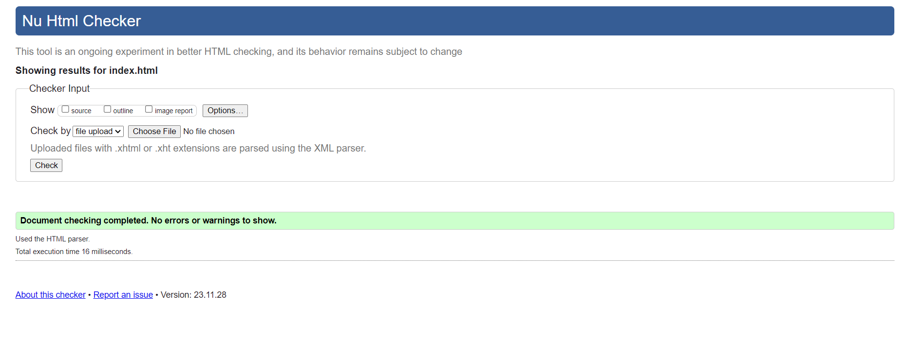
 - CSS
  - No errors returned when running through the official [Jigsaw Validator]

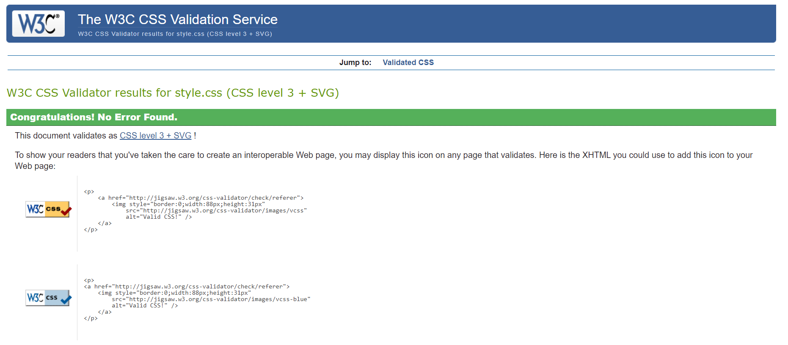

- JavaScript
  - No errors returned when running through the official [JSHint]
  - 4 unused variables but these are called in the HTML document.

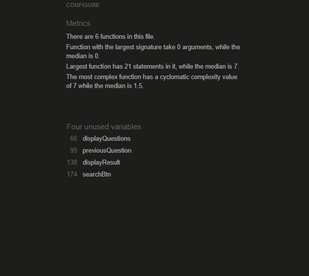

## Deployment 

- The site was deployed to GitHub pages. The steps to deploy are as follows:
  - I created a repository using GitHub repositories and the CI template.
  - I opened it in my preferred IDE (VS Code) to write the code.
  - I added all commits through the git change tab and also used this tab for pulling and pushing to my master branch.
  - In the GitHub repository, navigate to the Settings tab 
  - From the source section drop-down menu, select the Master Branch
  - Once the master branch has been selected, the page will be automatically refreshed with a detailed ribbon display to indicate the successful deployment. 

The live link can be found here - (https://mbutler1991.github.io/childhood-adhd-quiz/)

## Credits

### Content

The content for this website has mostly been taken from personal experiences from my partner and I who both have ADHD and a number of children with ADHD. My partner also has beeen studying related subjects.
The questions and scoring metrics were taken from the Conners 4 Clinical Index test which is a shortened version of the Conners 4 ADHD test.

### Media

Images and videos came from a number of different sources
 - Favicon from www.flaticon.com 
 - Background image was drawn by hand by my partner Nikita Ellison for the sole purpose of use in this project.
 - Links are from ADHD Ireland, HSE and YouTube videos from the HowToADHD Youtube channel. 

### Code

All code in this website is my own to the best of my knowledge, under the guidance of my mentor Lauren-Nicole Popich.

## Thanks

I would like to give recognition to my fantastic mentor Lauren-Nicole Popich for her help with and guidance on this project, to Laura Mayock for her informative lessons and assistance with any questions even though she is extremely busy and to my life partner Nikita Ellison for keeping me grounded, advising me to step away when needed, ensuring I took care of myself as I got lost in the code and for help with artwork and layout.
