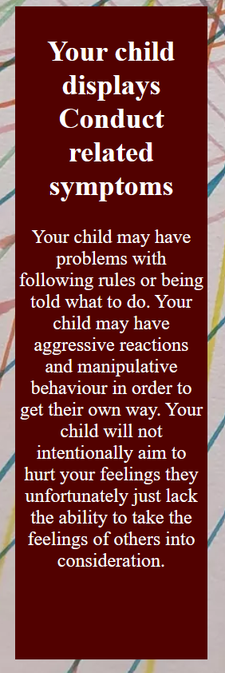

# Childhood ADHD Quiz

This project was made using Javascript, HTML and CSS to check the likelihood of your child/children having ADHD and which of the 5 different categories of symptoms they fall into. The target audience of this website is parents who are concerned that their child may have ADHD, teachers/school staff aiming to get an idea of the childs needs or even psychologists as we use the Conners test to build this and that would be the main test for childhood ADHD as it stands it alone cannot be used to make diagnosis as people can lie on the test but in the hands of a specialist can be used to help them reach a decision.

This website is mainly aimed at parents and if answered honestly can be used for pre screening for their children and to hopefully cut down the long waiting lists, 9 years plus in some countries to get a diagnosis.

This website can also be used in educational purposes as it breaks ADHD into the different categories of symptoms and gives a good overview on the people who display symptoms from these categories.

This can also be used by teenagers to do a self screening as the Conners test is applicable between ages of 6 to 18 and although this can't give a diagnosis knowing the likelihood can help some teenagers feel better about why things seem more difficult for them.

The aim is to work from this product to one day build a diagnostic app to cut out the long waiting times for diagnosis so that no child should be left behind.

I would ideally like to introduce ths to parents using SEO marketing, leveraging schools as they would like to assist parents in this and word of mouth ideally.

## User Stories

- As a student, I can check the likelihood of ADHD in myself, so that I can use resources gained to help myself study and learn in a way that works for me.
- As a parent, I can prescreen my own kids for ADHD and use the ADHD Assessment locator to best get my children diagnosed and find them the help they need.
- As a teacher, I can screen kids based off the multiple different categories so I know how best to plan my lessons so no child gets left behind.

## Features 

- __Header__

- this is featured on the top of the page and contains the name of the website and a logo which was downloaded from favicon.
- This is responsive and can be scaled for different browsers and screen sizes and will remain on top.
- The background and font colour follows same page layout.
  

- __Footer__

- this is featured on the bottom of the page.
- This is responsive and can be scaled for different browsers and screen sizes.
- It has a disclaimer that this cannot actually be used to diagnose and is for screening purposes only.
  

- __Quiz Area__

- This is the center focus of the page and contains navigation buttons and will populate all 24 questions and drop downs.
- This is designed to be resposive and also with larger text both for design and to help people with sight difficulties.
- It is also designed to be simple and easy to use.

- __Navigational Buttons__

- A next and a previous buttons to easily move through all 24 questions.
- Previous button will not allow movement before first question and next wont allow past last.
- Designed to be easy to understand.

- __Submit and Show Result__

- Submit button appears when all questions answered and show result appears after submit clicked.
- Submit button calculates scores up between all 6 metrics. Show Result reveals info based off each metric reached.
- Designed to be easy to understand.

- __Main result__

- This displays if your score is above the limit to be considered of ADHD.
- This gives an overview of ADHD and links to assessments and more resources.

- __Search Bar__

- This displays if your score is above the limit to be considered of ADHD.
- This has an input box where you can type in your current application.
- When you click search it will bring you to links for adhd assessors near the location in the input box.
- Link open in a seperate tab to not take away from current website.

- __More Resources__

- This displays if your score is above the limit to be considered of ADHD.
- This has links to more resources that could be handy to know if your child may have ADHD.
- There is a link to ADHD Ireland, CAMHS and some YouTube videos that have helpful advice and information.
- All links open in seperate tabs to not take away from current website.

- __Conduct__

- This displays if your responses display conduct/behavioural problems. 
- This has an insight into children who have these issues

- __Learning__

- This displays if your responses display learning problems. 
- This has an insight into children who have these issues

- __Psychosomatic__

- This displays if your responses display psychosomatic problems. 
- This has an insight into children who have these issues

- __Hyperactive and Impulsive__

- This displays if your responses display hyperactive/impulsive problems. 
- This has an insight into children who have these issues

- __Anxiety__

- This displays if your responses display anxiety problems. 
- This has an insight into children who have these issues

## Deployment 

- The site was deployed to GitHub pages. The steps to deploy are as follows:
  - I created a repository using GitHub repositories and the CI template.
  - I opened it in my preferred IDE (VS Code) to write the code.
  - I added all commits through the git change tab and also used this tab for pulling and pushing to my master branch.
  - In the GitHub repository, navigate to the Settings tab 
  - From the source section drop-down menu, select the Master Branch
  - Once the master branch has been selected, the page will be automatically refreshed with a detailed ribbon display to indicate the successful deployment. 

The live link can be found here - (https://mbutler1991.github.io/childhood-adhd-quiz/)
